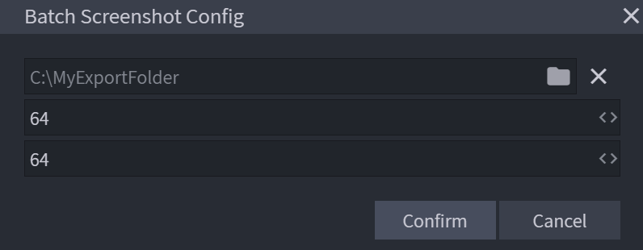
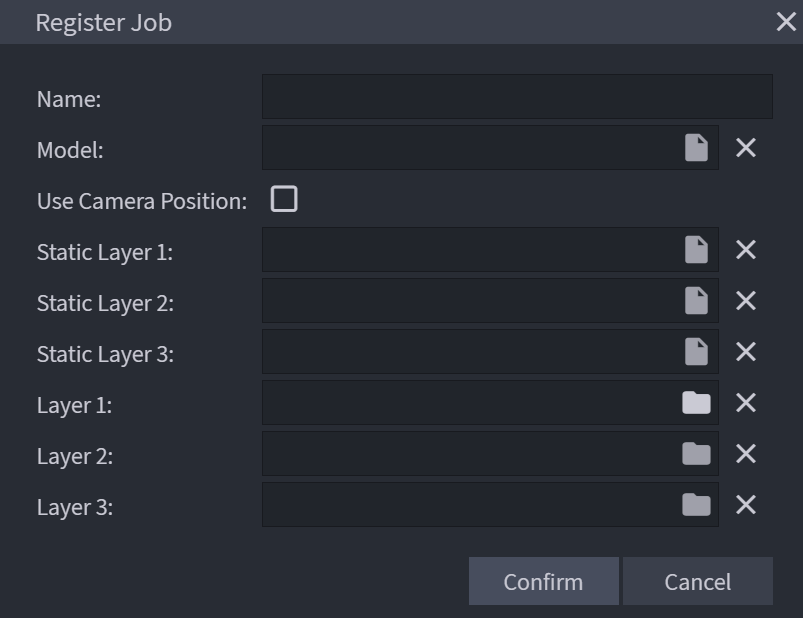
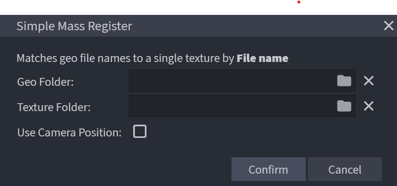

# Usage

## Steps 

### 1. Configure the Plugin
Go to `Filter -> Batch: Config` to set up the general configuration of the plugin.



Settings in order:
- `Path`: Path to export screenshots to.  
_Default_: `C:\Users\\*your username*\\.batch\\export`
- `Width`: Width of screenshot in pixels.
- `Height`: Height of screenshot in pixels.

### 2. Register a Job(s)
#### Register individual Jobs

Go to `Filter -> Batch: Register Job` to register a job. These jobs are saved in the '.batch' folder and can be found in the config window.



These are the settings
- `Name`: Name of the job
- `Model`: The geometry used for this job
- `Use Camera Position`: If ticked the current camera angle in Blockbench will be used instead of the default.

These options are only used for models that have 1 set of textures
- `Static Layer 1`: The first texture layer
- `Static Layer 2`: The second texture layer
- `Static Layer 3`: The third texture layer

These options are only used for models that have multiple variants of textures
- `Layer 1`: The folder containing the textures for the first layer*
- `Layer 2`: The folder containing the textures for the second layer*
- `Layer 3`: The folder containing the textures for the third layer*

*The plugin selects all files with the png extension.

```{note}
Only three layers can be active at any one time, adding more than three layers will cause the plugin to only use the first three layers!
```

Press confirm to save this job.

####  Mass Register Jobs
Go to `Filter -> Batch: Simple Mass Register` to enable mass geo and texture matching for generating many small jobs that only require one geo and one texture.



- `Geo Folder`: The folder containing the geos
- `Texture Folder`: The folder containing the textures
- `Use Camera Position`: If ticked the current camera angle in Blockbench will be used instead of the default.(this is duplicated for each object, thus the camera may be off)

### 3. Process Jobs
Go to `Filter -> Batch: Process Jobs` to begin processing the jobs.

- `Jobs`: Shows the number of jobs, not neccessary to be changed. 

Pressing confirm will start the process. **DO NOT** move the viewport during processing. Once finished, the plugin will write the images to disk.

## Best Practices
- Ensure that the geometry and texture files are correctly named and placed in the appropriate folders.
- Avoid moving the viewport during the processing of jobs to prevent errors in the screenshots.

## Additional Notes
To remove jobs, open your file explorer and go to the '.batch' folder (_Default_: `C:\Users\\*your username*\\.batch\\export`), open the 'jobs' folder, and remove any of the JSON files that you do not need.