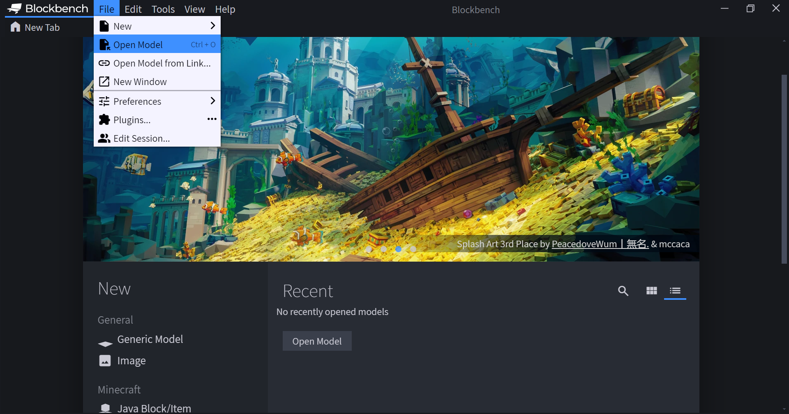
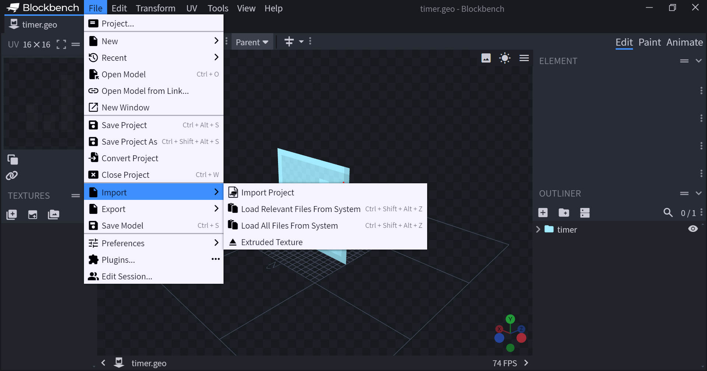

# Usage

## Steps 

### 1. Prepare your system
For this plugin to properly import the files we need to set up the system_template in a correct way. The plugin will search for a _scope.json file in order to identify the root of the system. That way you can still use subfolders. 

Here is an example for a folder structure of a system.

```java
- my_system
    - _scope.json
    - _map.py
    - some_file.json
    - some_other_file.json
    - big_chair
        - big_chair.geo.json
        - big_chair_0.animation.json
        - big_chair_1.animation.json
        - big_chair_0.png
        - big_chair_1.png
        - big_chair_2.png  
    - small_chair
        - small_chair.geo.json
        - small_chair.animation.json
        - small_chair.png                        
```

### 2. Open geometry file


Open the geometry file with Blockbench. You can either drag the file into Blockbench or open it through Blockbench by clicking `File -> Open Model` (Ctrl + O).


### 3. Load files


There are two options for importing files

#### Relevant files
This will load all files that are animations and all textures that have the correct extension based on the type of model. 

This means when a block model is opened it will only import textures with the `.block.png`, `.block.tga` extensions and an entity model will only import textures with the `.entity.png` and `.entity.tga` extensions.

Go to `File -> Import -> Load Relevant Files from System`

#### All files
This will load all files that are animations or textures.

Go to `File -> Import -> Load All Files from System`

## Additional Notes
You can set custom keybinds for the two buttons by following these steps:

1. Go to File -> Preferences -> Keybindings...
2. Search for Load Files From System
3. Set your keybinds